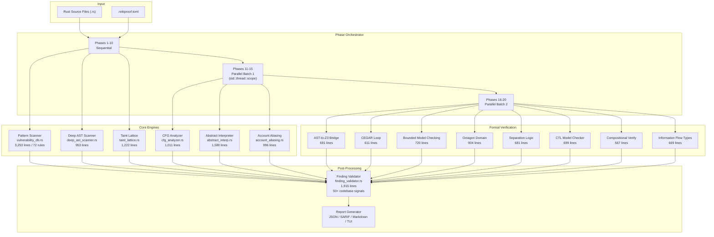
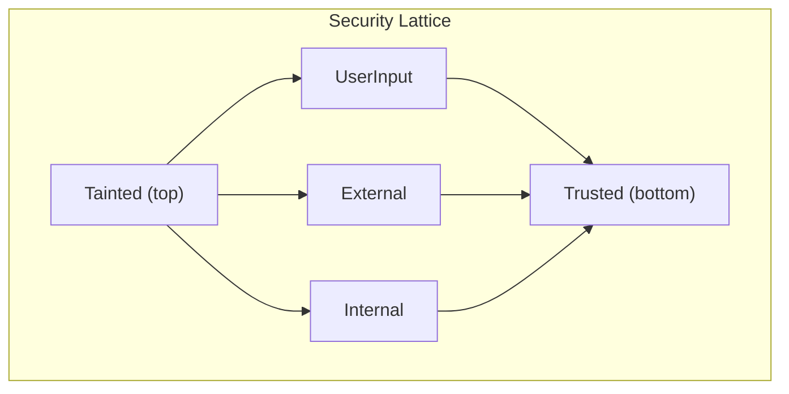
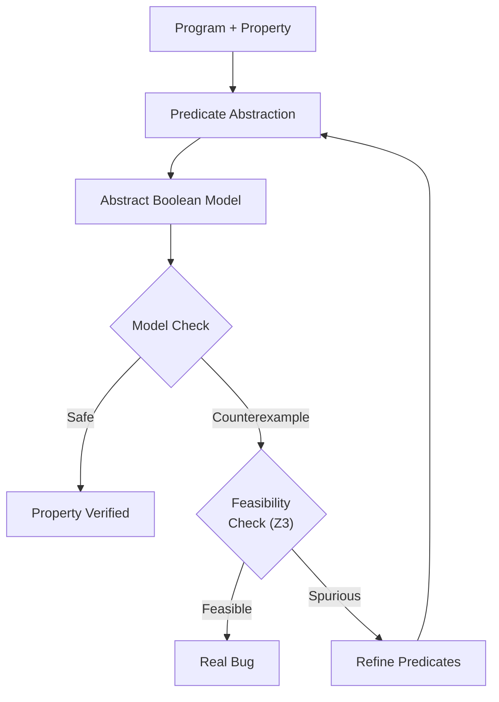
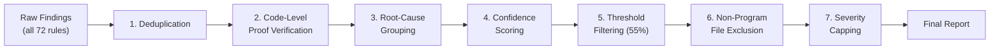

# rektproof

**Static analysis and formal verification toolkit for Solana smart contracts.**

rektproof is a multi-engine security scanner that combines pattern matching, abstract interpretation, taint analysis, control flow graph analysis, and SMT-backed formal verification to detect vulnerabilities in Solana programs written in Rust. It supports both native Solana programs and Anchor framework projects.

Built entirely in Rust. Ships as a single binary. Requires only Z3 as an external dependency.

---

## Table of Contents

- [Overview](#overview)
- [Architecture](#architecture)
- [Analysis Engines](#analysis-engines)
- [Formal Verification](#formal-verification)
- [Vulnerability Detectors](#vulnerability-detectors)
- [False Positive Elimination](#false-positive-elimination)
- [Interactive Dashboard](#interactive-dashboard)
- [REST API Server](#rest-api-server)
- [LSP Server](#lsp-server)
- [Supply Chain Scanner](#supply-chain-scanner)
- [Installation](#installation)
- [Usage](#usage)
- [CLI Reference](#cli-reference)
- [Configuration](#configuration)
- [Output Formats](#output-formats)
- [Test Suite](#test-suite)
- [Project Structure](#project-structure)
- [Experimental Modules](#experimental-modules)
- [Limitations and Transparency](#limitations-and-transparency)
- [CI/CD Integration](#cicd-integration)
- [Contributing](#contributing)
- [References](#references)
- [License](#license)

---

## Overview

rektproof scans Solana program source code across 20 analysis phases organized into three parallel execution batches. It produces structured vulnerability reports in JSON, SARIF v2.1.0, Markdown, or via an interactive terminal dashboard.

| Metric | Value |
|--------|-------|
| Total Rust source | 86,289 lines across 46 workspace crates |
| Vulnerability detectors | 72 patterns (SOL-001 through SOL-072) |
| Analysis techniques | 6 core engines, 14 formal proof modules |
| Test suite | 675 passing tests, 0 failures |
| Z3 solver integration | Real SMT constraint generation and solving |
| False positive mitigation | 7-stage validation pipeline with 50+ codebase signals |
| Output formats | JSON, SARIF v2.1.0, Markdown, Interactive TUI |
| API server | 22 REST endpoints with OpenAPI 3.0 spec |
| Editor integration | LSP server (tower-lsp) for VS Code and compatible editors |

### How It Works

1. Parses Solana Rust source code using the `syn` crate to produce typed ASTs
2. Runs 6 distinct analysis engines across the parsed code in parallel batches
3. Generates Z3 SMT constraints from arithmetic expressions and access control predicates
4. Applies a 7-stage false positive elimination pipeline that aggregates 50+ codebase signals
5. Produces structured reports with severity ratings, CWE mappings, attack scenarios, real-world incident references, and remediation guidance

### What It Does Not Do

- Does not execute programs on-chain or in a sandbox
- Does not perform runtime dynamic analysis
- Does not require a Solana validator or RPC connection for source scanning
- Advanced formal verification modules (CEGAR, BMC, separation logic, CTL) are tested independently but not yet integrated into the main scan pipeline
- Third-party tool wrappers (Kani, Certora, Crux-MIR) fall back to Z3 when the external tools are not installed. See [Transparency](#limitations-and-transparency) for details.

---

## Architecture



### Pipeline Execution

The scan pipeline is orchestrated by `lib.rs` (1,625 lines):

**Batch 1 -- Sequential (Phases 1-10):** Each phase runs in order. Results from earlier phases feed context into later ones. Covers pattern matching, AST scanning, taint analysis, and basic integrity checks.

**Batch 2 -- Parallel (Phases 11-15):** Independent analyses run concurrently using `std::thread::scope`. Includes invariant mining, DeFi pattern detection, dependency analysis, account aliasing, and cross-reference checks.

**Batch 3 -- Parallel (Phases 16-20):** Z3-backed analysis and formal property checking. Includes abstract interpretation with Z3 augmentation, AST-to-Z3 constraint generation, and the formal verification modules.

**Post-Processing:** All findings pass through `finding_validator.rs`, a 1,915-line false positive elimination pipeline. See [False Positive Elimination](#false-positive-elimination).

---

## Analysis Engines

### 1. Pattern Scanner

**File:** `vulnerability_db.rs` (3,253 lines) | **Technique:** Context-aware string pattern matching

Implements 72 vulnerability detection rules. Each rule is a function that examines source code text and parsed AST nodes, returning structured findings with severity, description, CWE mapping, attack scenarios, and remediation guidance. See [Vulnerability Detectors](#vulnerability-detectors) for the complete rule catalog.

### 2. Deep AST Scanner

**File:** `deep_ast_scanner.rs` (953 lines) | **Technique:** `syn::visit::Visit` trait-based AST traversal

Walks the full typed Rust AST to detect structural vulnerabilities:
- Missing signer validation on instruction handlers that perform lamport transfers
- Owner validation gaps when using raw `AccountInfo` instead of typed `Account<T>`
- Unsafe type casting and unchecked downcasting patterns
- Missing PDA seed validation in `create_program_address` calls
- Unchecked arithmetic on token balance and supply fields

### 3. Taint Lattice

**File:** `taint_lattice.rs` (1,222 lines) | **Technique:** Lattice-based information flow analysis with worklist fixed-point



Tracks data flow from untrusted sources (user inputs, CPI return values, deserialized account data) through the program. Uses a worklist algorithm with lattice join operations to compute a fixed point. Features interprocedural taint propagation, call graph edge merging, and source-sink vulnerability detection.

### 4. CFG Analyzer

**File:** `cfg_analyzer.rs` (1,011 lines) | **Technique:** Control flow graph with dominator tree analysis

Builds control flow graphs from parsed ASTs. Computes dominator trees, detects loops for resource exhaustion analysis, performs reachability analysis for dead code detection, and supports path-sensitive conditional vulnerability analysis.

### 5. Abstract Interpreter

**File:** `abstract_interp.rs` (1,580 lines) | **Technique:** Interval abstract domain with widening and narrowing

Performs sound over-approximation of program behavior using interval arithmetic. Transfer functions propagate intervals through arithmetic operations. The widening operator guarantees termination on loops. Used for arithmetic overflow detection, balance invariant checking, and array bounds analysis.

```
Domain: [lo, hi]  where lo, hi in Z u {-inf, +inf}
Join:   [a,b] |_| [c,d] = [min(a,c), max(b,d)]
Widen:  [a,b] W [c,d]   = [c<a ? -inf : a, d>b ? +inf : b]
```

### 6. Account Aliasing

**File:** `account_aliasing.rs` (996 lines) | **Technique:** Must-not-alias analysis for Anchor account structs

Detects scenarios where an attacker could pass the same account for two different instruction parameters, bypassing access control logic. Analyzes `#[account]` constraints, PDA seed uniqueness, and cross-account references.

---

## Formal Verification

rektproof implements 14 formal verification techniques backed by the Z3 SMT solver. Seven modules are in the core `program-analyzer` crate with full test coverage. Additional techniques are provided by the `symbolic-engine` experimental crate.

### AST-to-Z3 Bridge

**File:** `ast_to_z3.rs` (691 lines)

The core translation layer. Parses `syn::Expr` nodes into Z3 bitvector (BV64) terms. Generates overflow assertions for arithmetic operations. Encodes access control predicates. Z3 then solves these constraints to prove or disprove safety properties. This module is genuinely invoked by the scanner pipeline.

### CEGAR (Counterexample-Guided Abstraction Refinement)

**File:** `cegar.rs` (611 lines)

Implements the Ball-Rajamani (2001) abstraction refinement loop:



Automatically discovers Solana-specific predicates: signer checks, owner validation, PDA verification, rent enforcement, and balance comparisons. When Z3 proves a counterexample is spurious, new predicates are extracted from the infeasibility proof.

### Bounded Model Checking

**File:** `solana_bmc.rs` (720 lines)

Models Solana runtime semantics (lamports conservation, rent enforcement, signer verification, account locking) and unrolls transaction sequences up to a configurable depth. Z3 checks whether any reachable state violates safety properties. Produces concrete counterexamples with exact account states.

### Octagon Abstract Domain

**File:** `octagon_domain.rs` (904 lines)

Implements Mine's (2006) relational abstract domain using a Difference Bound Matrix with Floyd-Warshall closure. Tracks constraints of the form `+/- x +/- y <= c`. More precise than intervals because it captures variable relationships (e.g., `balance >= reserved`).

### Separation Logic

**File:** `separation_logic.rs` (681 lines)

Models Solana account ownership using separation logic. The separating conjunction `P * Q` proves that two accounts are genuinely distinct (non-aliased). Includes symbolic heap modeling, the frame rule for modular verification, and PDA distinctness proofs.

### CTL Model Checker

**File:** `temporal_logic.rs` (699 lines)

Implements Computation Tree Logic model checking using fixed-point algorithms from Clarke, Grumberg, and Peled (1999). Verifies temporal properties of state machines such as `AG(initialized -> AF(can_close))`.

### Compositional Verification

**File:** `compositional_verify.rs` (567 lines)

Assume-guarantee reasoning for CPI chains. Uses pre-built specifications for SPL Token and System Program operations. Flags calls to unknown programs as unverifiable rather than making unsound assumptions.

### Information Flow Types

**File:** `information_flow_types.rs` (669 lines)

Five-level security type system (`Trusted < Verified < Internal < UserInput < Tainted`) enforcing non-interference. Tracks both explicit flows (direct assignment) and implicit flows (conditional branches). CPI return values are automatically classified as `Tainted`.

### Symbolic Engine (Experimental)

**Crate:** `symbolic-engine` (2,477 lines across 3 modules)

| Technique | Description |
|-----------|-------------|
| k-Induction | Base case + inductive step proofs for invariant verification |
| Weakest Precondition | Hoare-logic backward transformer for instruction sequences |
| Craig Interpolation | Approximate interpolant discovery from UNSAT proof structure |
| Game-Theoretic Analysis | Models AMM interactions as strategic games for MEV resistance |
| Fixed-Point Lattice | Ascending chain computation with widening for invariant inference |

---

## Vulnerability Detectors

All 72 detection rules with their severity levels and categories:

### Access Control (SOL-001 -- SOL-010)

| ID | Name | Severity |
|----|------|----------|
| SOL-001 | Missing Signer Check | Critical |
| SOL-002 | Integer Overflow | High |
| SOL-003 | Missing Owner Check | Critical |
| SOL-004 | Type Cosplay | Critical |
| SOL-005 | Arbitrary CPI | Critical |
| SOL-006 | Closing Account Vulnerability | Critical |
| SOL-007 | Bump Seed Issues | High |
| SOL-008 | PDA Sharing | High |
| SOL-009 | Account Data Matching | High |
| SOL-010 | Sysvar Address Issues | Medium |

### Initialization and State (SOL-011 -- SOL-020)

| ID | Name | Severity |
|----|------|----------|
| SOL-011 | Initialization Issues | High |
| SOL-012 | Duplicate Mutable Accounts | High |
| SOL-013 | Missing Rent Exemption | Medium |
| SOL-014 | Unvalidated Return Data | High |
| SOL-015 | Missing Program ID Check | Critical |
| SOL-016 | CEI Violation | High |
| SOL-017 | Reentrancy Risk | Critical |
| SOL-018 | Flash Loan Attack | Critical |
| SOL-019 | Oracle Manipulation | Critical |
| SOL-020 | Price Stale Data | High |

### Token Security (SOL-021 -- SOL-032)

| ID | Name | Severity |
|----|------|----------|
| SOL-021 | Mint Authority Issues | Critical |
| SOL-022 | Token Account Confusion | Critical |
| SOL-023 | SPL Token Overflow | High |
| SOL-024 | Missing Token Freeze | High |
| SOL-025 | Lamport Balance Drain | Critical |
| SOL-026 | Token Extension Bypass | High |
| SOL-027 | PDA Authority Escalation | Critical |
| SOL-028 | Unchecked Transfer Amount | High |
| SOL-029 | Missing ATA Validation | High |
| SOL-030 | Instruction Introspection | High |
| SOL-031 | Unauthorized Token Mint | Critical |
| SOL-032 | Missing Decimals Check | Medium |

### DeFi and MEV (SOL-033 -- SOL-052)

| ID | Name | Severity |
|----|------|----------|
| SOL-033 | Slippage Attack | High |
| SOL-034 | Sandwich Attack | High |
| SOL-035 | Front-Running | High |
| SOL-036 | Liquidity Pool Drain | Critical |
| SOL-037 | Governance Token Exploit | High |
| SOL-038 | Precision Loss | High |
| SOL-039 | Rounding Errors | Medium |
| SOL-040 | Missing Zero Check | Medium |
| SOL-041 | Emergency Withdraw Missing | High |
| SOL-042 | Missing Pause Mechanism | High |
| SOL-043 | Hardcoded Address | Info |
| SOL-044 | Missing Event Emission | Info |
| SOL-045 | Unsafe Math Operations | High |
| SOL-046 | Time Manipulation | Medium |
| SOL-047 | Missing Access Control | Critical |
| SOL-048 | Account Hijacking | Critical |
| SOL-049 | LP Token Manipulation | High |
| SOL-050 | Oracle Dependence Risk | High |
| SOL-051 | Missing Deadline Check | Medium |
| SOL-052 | Governance Attack | High |

### Advanced Solana-Specific (SOL-053 -- SOL-072)

| ID | Name | Severity |
|----|------|----------|
| SOL-053 | Close Account Resurrection | Critical |
| SOL-054 | Program Impersonation | Critical |
| SOL-055 | Token2022 Transfer Hook Risk | High |
| SOL-056 | Token2022 Fee Mismatch | High |
| SOL-057 | Permanent Delegate Exposure | High |
| SOL-058 | Flash Loan Price Manipulation | Critical |
| SOL-059 | Missing State Machine | High |
| SOL-060 | Event Log Spoofing | Medium |
| SOL-061 | CU Exhaustion Partial State | High |
| SOL-062 | Unbounded Input Length | Medium |
| SOL-063 | Unvalidated remaining_accounts | High |
| SOL-064 | Governance Bypass Risk | High |
| SOL-065 | PDA Seed Collision Risk | Medium |
| SOL-066 | Insufficient MEV Protection | Medium |
| SOL-067 | Single Wallet Upgrade Authority | High |
| SOL-068 | Unvalidated Freeze Authority | Medium |
| SOL-069 | Cross-IX Duplicate Accounts | Critical |
| SOL-070 | Legacy vs V0 Transaction Risk | Medium |
| SOL-071 | Lookup Table Trust Risk | Medium |
| SOL-072 | Missing Slippage Cap | High |

---

## False Positive Elimination

**File:** `finding_validator.rs` (1,915 lines)

The finding validator is the core accuracy component. It models how a professional Solana auditor triages scanner output: for every finding, it asks "could an attacker actually exploit this given the full codebase context?"

### Pipeline Stages



### ProjectContext: 50+ Codebase Signals

Before evaluating any finding, the validator builds a `ProjectContext` from all source files. This aggregates 50+ signals:

**Safety Pattern Detection:**
- `checked_add`, `checked_sub`, `checked_mul`, `saturating_*` usage
- Safe math modules and `overflow-checks` in Cargo.toml
- Error handling patterns (`.ok_or()`, `.map_err()`, `ErrorCode::`)
- Access control (`has_one`, `constraint =`, `require_keys_eq`)
- PDA validation (`seeds =`, `find_program_address`, `bump`)
- CPI guards (`CpiContext::new`, typed `Program<>`)
- Oracle staleness checks (`max_age`, `publish_time`, `get_price_no_older_than`)
- Slippage protection, pause mechanisms, reentrancy guards
- Event emission, decimals handling, AMM invariant checks

**Per-Function Analysis:**
- PDA-signed functions (using `new_with_signer` / `invoke_signed`)
- Anchor `#[account(init)]` protected functions
- Mint authority via PDA constraints
- Functions with slippage checks, amount validation, time checks
- Helper function detection (non-handler internal functions)

**Typed Account Ratio:**
Computes the ratio of typed Anchor accounts (`Account<T>`, `Signer`, `Program<T>`) to raw `AccountInfo`. High ratios indicate a mature Anchor codebase where many vulnerability classes are structurally impossible.

**Maturity Score:**
A weighted 0.0-1.0 score computed from 17 boolean safety signals. Used to adjust finding confidence levels.

### Per-Rule Proof Verification

For each finding ID, specialized verification logic checks whether the code contains mitigations the pattern matcher could not see:

- **SOL-001 (Missing Signer):** Checks for Anchor `Signer<>` type, `is_signer` assertion, `has_one = authority`
- **SOL-021 (Mint Authority):** Checks for PDA-signed CPI (`new_with_signer`), cross-file helper resolution, Anchor `mint::authority` constraint
- **SOL-011 (Reinitialization):** Checks for `#[account(init)]`, `load_init()`, owner == system_program guard, `create_account` (which fails on existing accounts)
- **SOL-048 (Account Hijacking):** Checks for PDA signer seeds, helper function context, `create_account` + seeds
- **SOL-049 (LP Manipulation):** Checks for constant product invariant, AMM math, u128 precision
- **SOL-055 (Token2022 Hook):** Checks for extension whitelist/blacklist guards

And 30+ more rule-specific verification functions.

### Zero False Positive Regression

`zero_false_positives.rs` contains 15 test cases that verify rektproof produces zero findings on code using secure patterns:
- `checked_add` / `checked_sub` / `checked_mul`
- `require!(ctx.accounts.authority.is_signer)`
- `has_one = authority` Anchor constraint
- PDA with bump seed validation
- Switchboard and Pyth oracle validation
- CEI (Checks-Effects-Interactions) pattern
- Slippage tolerance checks
- Constant product AMM invariant

If any test produces a finding, the test suite fails.

---

## Interactive Dashboard

**File:** `dashboard.rs` (1,154 lines) | **Framework:** Ratatui + Crossterm

The default output mode is an interactive terminal dashboard with a custom dark theme and neon accent palette.

### Tabs

| Tab | Key | Contents |
|-----|-----|----------|
| Overview | `1` | Security score gauge, severity bar chart, confidence distribution, category heatmap, CWE breakdown |
| Findings | `2` | Scrollable finding list with severity filter, detail panel with code, attack scenario, real-world incidents, and fixes |
| Engines | `3` | Per-phase result bars showing which engines produced findings, with animated progress indicators |
| Fixes | `4` | Priority-ordered fix queue with remediation guidance |
| Help | `5` or `?` | Keybinding reference |

### Keyboard Controls

| Key | Action |
|-----|--------|
| `Tab` / `Shift+Tab` | Next / previous tab |
| `j` / `k` or arrows | Navigate findings |
| `Enter` | Toggle detail popup |
| `c`, `h`, `m`, `l`, `i` | Toggle severity filter (Critical, High, Medium, Low, Info) |
| `d` / `u` | Scroll detail panel down / up |
| `q` or `Esc` | Quit |

---

## REST API Server

**Crate:** `shanon-api` (3,726 lines across 7 source files) | **Framework:** Actix-web

Full REST API with 22 endpoints, OpenAPI 3.0 specification, API key authentication, and rate limiting.

### Endpoints

| Method | Path | Description |
|--------|------|-------------|
| GET | `/health` | Health check with uptime and version |
| GET | `/api/v1/risk/{program_id}` | Risk score for a Solana program |
| GET | `/api/v1/risk/{program_id}/flags` | Detailed security flags |
| GET | `/api/v1/analyst/{wallet}` | Analyst profile and stats |
| GET | `/api/v1/analysts` | List active security analysts |
| GET | `/api/v1/stats` | Global oracle statistics |
| GET | `/api/v1/programs` | List all scored programs (paginated) |
| POST | `/api/v1/scan` | Trigger a security scan (async job) |
| GET | `/api/v1/scan/{job_id}` | Poll scan job status and results |
| GET | `/api/v1/scan/jobs` | List all scan jobs |
| GET | `/api/v1/engines` | List analysis engines with descriptions |
| GET | `/api/v1/detectors` | List all 72 vulnerability detectors |
| GET | `/api/v1/exploits` | Known exploit database |
| GET | `/api/v1/archives` | Archived scan results |
| POST | `/api/v1/guard` | Dependency supply chain scan |
| GET | `/api/v1/scoreboard` | Security scoreboard |
| GET | `/api/v1/scoreboard/{id}` | Scoreboard detail |
| POST | `/api/v1/scoreboard/scan` | Trigger scoreboard scan |
| GET | `/api/v1/scoreboard/{id}/badge` | SVG security badge |
| GET | `/api/v1/token/{mint}/risk` | Token risk assessment |
| POST | `/api/v1/simulate` | Transaction simulation |
| GET | `/api/v1/authority/{program_id}` | Upgrade authority status |
| GET | `/api/v1/openapi.json` | OpenAPI 3.0 specification |

### Running the API Server

```bash
export SHANON_API_KEY=your-api-key
export RPC_URL=https://api.mainnet-beta.solana.com
cargo run -p shanon-api
```

---

## LSP Server

**Crate:** `shanon-lsp` (195 lines) | **Framework:** tower-lsp

Language Server Protocol implementation providing real-time vulnerability highlighting in VS Code, Neovim, and other LSP-compatible editors.

Implements `textDocument/didOpen`, `textDocument/didChange`, and `textDocument/didSave` handlers. On each save, runs the full 72-rule vulnerability scanner on the open file and publishes diagnostics with severity-mapped diagnostic levels, finding IDs as diagnostic codes, and remediation suggestions in the message body.

```bash
# Run the LSP server (connects via stdin/stdout)
cargo run -p shanon-lsp
```

For VS Code, configure in `.vscode/settings.json`:
```json
{
  "shanon-lsp.serverPath": "./target/release/shanon-lsp"
}
```

---

## Supply Chain Scanner

**Crate:** `shanon-guard` (1,791 lines across 6 modules)

Scans project dependencies for supply chain attack indicators:

| Module | Lines | Function |
|--------|-------|----------|
| `cargo_scanner.rs` | 228 | Parses `Cargo.lock` and checks crate provenance |
| `npm_scanner.rs` | 220 | Parses `package-lock.json` for JavaScript dependencies |
| `advisory_db.rs` | 347 | Queries RustSec advisory database for known CVEs |
| `typosquat.rs` | 197 | Detects typosquatting attempts (e.g., `sollana-program`) |
| `behavioral.rs` | 255 | Flags suspicious crate behaviors (network access, file system writes, proc macros) |
| `report.rs` | 171 | Structured report generation |

```bash
shanon guard --path ./my-project --fail-on critical
```

---

## Installation

### Prerequisites

- Rust 1.75 or later
- Z3 solver (`libz3-dev` on Debian/Ubuntu, `z3` via Homebrew on macOS)
- pkg-config

### Build from Source

```bash
git clone https://github.com/brainless3178/rektproof.git
cd rektproof
cargo build --release
```

The binary is produced at `./target/release/shanon`.

```bash
./target/release/shanon --version
./target/release/shanon --help
```

---

## Usage

### Basic Scan

```bash
# Scan with interactive dashboard (default)
shanon scan ./programs/my-protocol/src

# JSON output
shanon scan ./programs/my-protocol/src --format json

# Filter by severity
shanon scan ./programs/my-protocol/src --min-severity high

# SARIF output for CI
shanon scan ./programs/my-protocol/src --format sarif > results.sarif

# Markdown audit report
shanon scan ./programs/my-protocol/src --format markdown > audit.md
```

### Formal Verification Pipeline

```bash
shanon verify-formal ./programs/my-protocol/src --format json
```

Runs sequentially: Kani model checking (Z3 fallback), Certora rule generation (Z3 fallback), Wacana concolic analysis, AST security scanning, and the 4-layer Z3 verification pipeline.

### Fuzzing Pipeline

```bash
shanon fuzz ./programs/my-protocol/src --iterations 10000 --format json
```

Orchestrates Trident stateful fuzzing, FuzzDelSol binary fuzzing (if an SBF binary is available), and coverage-guided security fuzzing.

### DeFi Economic Verification

```bash
shanon economic-verify ./programs/amm/src --format json
```

Uses Z3 to verify solvency, share ratio bounds, fee conservation, constant product invariants, and first-depositor attack resistance.

### Remote Repository Scanning

```bash
shanon scan-repo https://github.com/user/solana-program.git --branch main
```

### Full Orchestrated Pipeline

```bash
shanon orchestrate ./programs/src --format json --api-key $OPENROUTER_API_KEY
```

Runs: scan, multi-LLM consensus verification, AI exploit strategy generation, and consolidated reporting.

---

## CLI Reference

```
shanon <COMMAND>

Commands:
  scan              Scan a Solana program (default: interactive dashboard)
  scan-repo         Clone and scan a remote Git repository
  score             Compute security score for a program
  guard             Dependency supply chain scan
  verify            Verify deployed program against source
  verify-formal     Full formal verification pipeline
  fuzz              Fuzzing analysis pipeline
  economic-verify   DeFi economic invariant verification
  firedancer-check  Firedancer validator compatibility check
  cpi-graph         Cross-program invocation graph analysis
  token-scan        Token-2022 security analysis
  watch             Monitor upgrade authority changes
  benchmark         Performance benchmarks
  orchestrate       Full pipeline with AI-enhanced analysis
```

### Scan Options

| Flag | Description | Default |
|------|-------------|---------|
| `--format` | `dashboard`, `json`, `human`, `sarif`, `markdown` | `dashboard` |
| `--min-severity` | `critical`, `high`, `medium`, `low`, `info` | `info` |
| `--ai` | Enable AI-enhanced analysis | off |
| `--ai-strategy` | Generate exploit strategies for high/critical findings | off |
| `--consensus` | Multi-LLM consensus false positive reduction | off |
| `--fix` | Generate fix suggestions | off |
| `--poc` | Generate proof-of-concept exploit sketches | off |
| `--simulate` | Run attack simulation | off |
| `--verbose` | Verbose output | off |
| `--api-key` | API key for AI features (or `OPENROUTER_API_KEY` env var) | none |
| `--model` | AI model identifier | `moonshotai/kimi-k2.5` |

---

## Configuration

Project-level configuration via `.rektproof.toml`:

```toml
[scan]
min_severity = "medium"
enabled_engines = ["pattern", "taint", "cfg", "abstract_interp", "aliasing", "z3"]

[ignore]
rules = ["SOL-015", "SOL-042"]
functions = ["test_*", "mock_*"]
paths = ["tests/", "benches/"]

[output]
format = "json"
sarif = true

[z3]
timeout_ms = 30000

[report]
include_remediation = true
include_references = true
```

**Precedence:** CLI flags > `.rektproof.toml` > built-in defaults.

---

## Output Formats

### JSON

```json
{
  "findings": [{
    "id": "SOL-001",
    "severity": 5,
    "title": "Missing Signer Verification",
    "description": "Instruction handler does not validate signer authority",
    "file": "src/processor.rs",
    "line": 42,
    "function": "withdraw",
    "category": "AccessControl",
    "cwe": "CWE-862",
    "confidence": 92,
    "attack_scenario": "An attacker calls withdraw() without signing...",
    "real_world_incident": {"project": "Cashio", "loss": "$52M", "date": "2022-03-23"},
    "remediation": "Add require!(ctx.accounts.authority.is_signer) check",
    "vulnerable_code": "pub fn withdraw(ctx: Context<Withdraw>, amount: u64) -> Result<()> { ... }"
  }],
  "summary": {
    "total": 12,
    "critical": 2,
    "high": 3,
    "medium": 5,
    "low": 2,
    "scan_duration_ms": 1847
  }
}
```

### SARIF v2.1.0

Spec-compliant Static Analysis Results Interchange Format. Compatible with GitHub Code Scanning (`github/codeql-action/upload-sarif`), Azure DevOps, Visual Studio, and JetBrains SARIF plugin.

### Markdown

Professional audit-style report with executive summary, per-finding details, engine breakdown, and remediation recommendations.

---

## Test Suite

675 passing tests across 30+ files:

```bash
cargo test --workspace                          # All tests
cargo test -p program-analyzer --lib             # Core engine (180 tests)
cargo test -p program-analyzer --lib cegar       # CEGAR module
cargo test -p program-analyzer --lib solana_bmc  # BMC module
cargo test -p program-analyzer --lib zero_false  # FP regression (15 tests)
```

| Category | Count | Description |
|----------|-------|-------------|
| Core analyzer | 180 | Pattern matching, AST, taint, CFG, abstract interpretation, aliasing |
| Formal verification | 40+ | CEGAR, BMC, octagon domain, separation logic, CTL, compositional, IFC |
| False positive regression | 15 | Secure patterns must produce zero findings |
| CVE regression | 8 | Known vulnerability reproduction |
| Experimental crate tests | 400+ | All 33 experimental modules |
| Serialization roundtrip | 20+ | JSON and SARIF format correctness |

---

## Project Structure

```
rektproof/
  crates/
    program-analyzer/             Core engine (23,582 lines)
      src/
        lib.rs                    Phase orchestrator (1,625 lines)
        vulnerability_db.rs       72 detection rules (3,253 lines)
        finding_validator.rs      False positive elimination (1,915 lines)
        abstract_interp.rs        Interval abstract domain (1,580 lines)
        taint_lattice.rs          Taint analysis (1,222 lines)
        cfg_analyzer.rs           CFG + dominators (1,011 lines)
        account_aliasing.rs       Must-not-alias (996 lines)
        deep_ast_scanner.rs       AST traversal (953 lines)
        octagon_domain.rs         Relational abstract domain (904 lines)
        defi_detector.rs          DeFi patterns (780 lines)
        solana_bmc.rs             Bounded model checking (720 lines)
        temporal_logic.rs         CTL model checking (699 lines)
        ast_to_z3.rs              AST-to-Z3 BV64 bridge (691 lines)
        separation_logic.rs       Account ownership proofs (681 lines)
        information_flow_types.rs Security type system (669 lines)
        cegar.rs                  Abstraction refinement (611 lines)
        compositional_verify.rs   CPI assume-guarantee (567 lines)
        vuln_knowledge_base.rs    Attack scenario database (957 lines)
        ast_checks.rs             AST-level checks (978 lines)
        rektproof_config.rs       .rektproof.toml parser (241 lines)

    shanon-cli/                   CLI (3,336 lines)
      src/
        main.rs                   Entry point + command dispatch
        commands/                 Command modules
          formal.rs               verify-formal pipeline
          fuzz.rs                 Fuzzing pipeline
          economic.rs             Economic verification
          scan.rs                 Remote repo scanning
          helpers.rs              Shared utilities
        dashboard.rs              Ratatui TUI (1,154 lines)
        tui.rs                    Non-interactive output (445 lines)

    shanon-api/                   REST API (3,726 lines)
      src/
        main.rs                   Actix-web server setup
        routes.rs                 22 endpoint handlers (1,362 lines)
        openapi.rs                OpenAPI 3.0 spec (561 lines)
        worker.rs                 Background scan jobs (832 lines)
        rate_limiter.rs           Token bucket rate limiting (248 lines)
        scoreboard.rs             Security scoreboard (370 lines)
        badge.rs                  SVG badge generation (137 lines)

    shanon-lsp/                   LSP server (195 lines)
    shanon-verify/                Badge and tier system (461 lines)
    shanon-guard/                 Supply chain scanner (1,791 lines)
    shanon-monitor/               Authority monitoring (767 lines)

    experimental/                 33 experimental crates
      wacana-analyzer/            Concolic execution (4,672 lines)
      kani-verifier/              Kani harness + Z3 fallback (3,971 lines)
      symbolic-engine/            Z3 proof engine (3,587 lines)
      certora-prover/             Certora rules + Z3 fallback (3,367 lines)
      sec3-analyzer/              Soteria-style checks (2,766 lines)
      anchor-security-analyzer/   Anchor-specific analysis (2,511 lines)
      trident-fuzzer/             Stateful fuzzing (2,483 lines)
      dataflow-analyzer/          Use-def chain analysis (2,294 lines)
      taint-analyzer/             Extended taint analysis (2,248 lines)
      l3x-analyzer/               Heuristic anomaly detection (1,895 lines)
      economic-verifier/          DeFi invariant verification (1,783 lines)
      geiger-analyzer/            Unsafe code detection (1,532 lines)
      fuzzdelsol/                 SBF binary fuzzing (1,298 lines)
      security-fuzzer/            Coverage-guided fuzzing (1,055 lines)
      attack-simulator/           Attack scenario simulation (909 lines)
      llm-strategist/             AI exploit strategies (753 lines)
      invariant-miner/            Invariant discovery (729 lines)
      transaction-forge/          Test transaction construction (705 lines)
      consensus-engine/           Multi-LLM consensus (588 lines)
      concolic-executor/          Concolic path exploration (558 lines)
      ...and 13 additional crates

  programs/
    vulnerable-token/             Intentionally vulnerable test program
    shanon-oracle/                On-chain verification oracle
```

---

## Experimental Modules

The 33 crates in `crates/experimental/` provide optional analysis capabilities. All are functional with passing tests.

### Concolic Execution

**Crate:** `wacana-analyzer` (4,672 lines)

Combines concrete execution with symbolic constraint collection. Executes WASM/SBF instructions concretely, collects path constraints symbolically, negates branch conditions to explore alternative paths, and uses Z3 to generate inputs reaching uncovered paths.

### Third-Party Tool Wrappers

| Crate | Purpose | When External Tool Missing |
|-------|---------|---------------------------|
| `kani-verifier` (3,971 lines) | Generates Kani proof harnesses from extracted invariants | Falls back to Z3 SMT analysis |
| `certora-prover` (3,367 lines) | Generates CVL specification rules from source patterns | Falls back to Z3 SMT verification |
| `crux-mir-analyzer` (437 lines) | AST-based security scanning via `syn::visit` | Always runs AST analysis (Crux-MIR tool is not invoked) |

**Transparency note:** Module doc headers explicitly state when external tools are not installed and Z3 fallback is active. The `crux-mir-analyzer` `prover_backend` field reads `"AST Security Scanner (syn::visit fallback)"`.

### Fuzzing Harnesses

| Crate | Lines | Technique |
|-------|-------|-----------|
| `trident-fuzzer` | 2,483 | Stateful fuzzing harness generation for Anchor programs |
| `fuzzdelsol` | 1,298 | SBF binary instruction mutation fuzzing |
| `security-fuzzer` | 1,055 | Coverage-guided fuzzing with corpus management |

### Heuristic Analysis

The `l3x-analyzer` (1,895 lines) uses weighted token scoring and CFG structural analysis to flag anomalous code. Uses bag-of-words frequency analysis with hand-tuned weights and cosine similarity. It does not use machine learning, neural networks, or trained models. Module documentation explicitly states this.

---

## Limitations and Transparency

### Pipeline Integration Gap

The 7 advanced formal verification modules (CEGAR, BMC, octagon domain, separation logic, CTL, compositional verification, information flow types) are tested independently with 40+ passing tests. They are not yet wired into the main `shanon scan` command as automatic passes. Integration requires frontend passes that extract abstract models from the Rust AST.

### Analysis Scope

- **Per-file analysis:** Taint propagation and call graph construction operate within a single file. Cross-crate interprocedural analysis is not implemented.
- **No incremental scanning:** Every invocation performs a full re-scan.
- **Pattern matching foundation:** The majority of the 72 detectors use context-aware string pattern matching plus AST analysis. This is standard practice for SAST tools but is less precise than full semantic analysis.

### Bounded Verification

- Bounded model checking is sound up to the configured depth bound only
- Craig interpolation uses heuristic approximation, not Z3's native interpolation API
- Concolic execution covers basic WASM operations, not the full SBF instruction set

### External Dependencies

- Z3 must be installed for formal verification features
- Solana SDK is pinned to v1.18.x (needs updating for Solana v2.x)
- AI features require `OPENROUTER_API_KEY`

### Naming Conventions

- The `kani-verifier`, `certora-prover`, and `crux-mir-analyzer` crate names reference external tools. These crates generate harnesses and specifications compatible with those tools but fall back to Z3 when the tools are unavailable. Module doc headers clearly document this behavior.
- The `l3x-analyzer` uses the term "embeddings" for TF-IDF frequency vectors and "GNN" for CFG structural analysis. Module docs clarify these are heuristic techniques, not neural networks.

---

## CI/CD Integration

### GitHub Actions

```yaml
name: Security Scan
on: [push, pull_request]

jobs:
  rektproof:
    runs-on: ubuntu-latest
    steps:
      - uses: actions/checkout@v4

      - name: Install Z3
        run: sudo apt-get install -y libz3-dev

      - name: Install rektproof
        run: cargo install --path .

      - name: Scan
        run: shanon scan ./programs/src --format sarif --min-severity medium > results.sarif

      - name: Upload SARIF
        uses: github/codeql-action/upload-sarif@v3
        with:
          sarif_file: results.sarif
```

### Pre-Commit Hook

```bash
#!/bin/sh
result=$(shanon scan ./programs/src --format json --min-severity high 2>/dev/null)
critical=$(echo "$result" | jq '.summary.critical + .summary.high')
if [ "$critical" != "0" ] && [ "$critical" != "null" ]; then
    echo "Security scan found high/critical issues. Commit blocked."
    exit 1
fi
```

### Supply Chain Gate

```bash
shanon guard --path . --fail-on critical
```

Returns exit code 1 if critical supply chain issues are found.

---

## Contributing

### Development Setup

```bash
git clone https://github.com/brainless3178/rektproof.git
cd rektproof
cargo build
cargo test --workspace
```

### Running Specific Tests

```bash
cargo test -p program-analyzer --lib              # Core engine
cargo test -p program-analyzer --lib cegar         # CEGAR
cargo test -p program-analyzer --lib solana_bmc    # BMC
cargo test -p program-analyzer --lib octagon       # Octagon domain
cargo test -p program-analyzer --lib separation    # Separation logic
cargo test -p program-analyzer --lib temporal      # CTL
cargo test -p program-analyzer --lib compositional # Compositional
cargo test -p program-analyzer --lib information   # IFC
cargo test -p program-analyzer --lib zero_false    # FP regression
cargo test -p crux-mir-analyzer                    # Crux-MIR AST scanner
cargo test -p fv-scanner-core                      # FV pipeline
```

### Code Standards

- `cargo fmt` for formatting
- `cargo clippy` for linting
- New detectors must include positive and negative test cases
- Zero false positive regression tests must not break
- Module doc headers must accurately describe capabilities

---

## References

### Formal Methods

- Ball, T. and Rajamani, S.K. (2001). "Automatically Validating Temporal Safety Properties of Interfaces." SPIN Workshop.
- Mine, A. (2006). "The Octagon Abstract Domain." Higher-Order and Symbolic Computation, 19(1), 31-100.
- Clarke, E., Grumberg, O., and Peled, D. (1999). Model Checking. MIT Press.
- Reynolds, J.C. (2002). "Separation Logic: A Logic for Shared Mutable Data Structures." LICS.
- Henzinger, T. et al. (2002). "Lazy Abstraction." POPL.
- Biere, A. et al. (1999). "Symbolic Model Checking without BDDs." TACAS.
- Denning, D. and Denning, P. (1977). "Certification of Programs for Secure Information Flow." CACM, 20(7).

### Solana Security

- Solana Program Security Guidelines: https://docs.solana.com/developing/programming-model/security
- Anchor Framework: https://www.anchor-lang.com/
- Neodyme: Common Solana Program Vulnerabilities
- sec3 (formerly Soteria): Automated Solana Security Analysis

---

## License

This project is licensed under the MIT License. See the LICENSE file for details.
