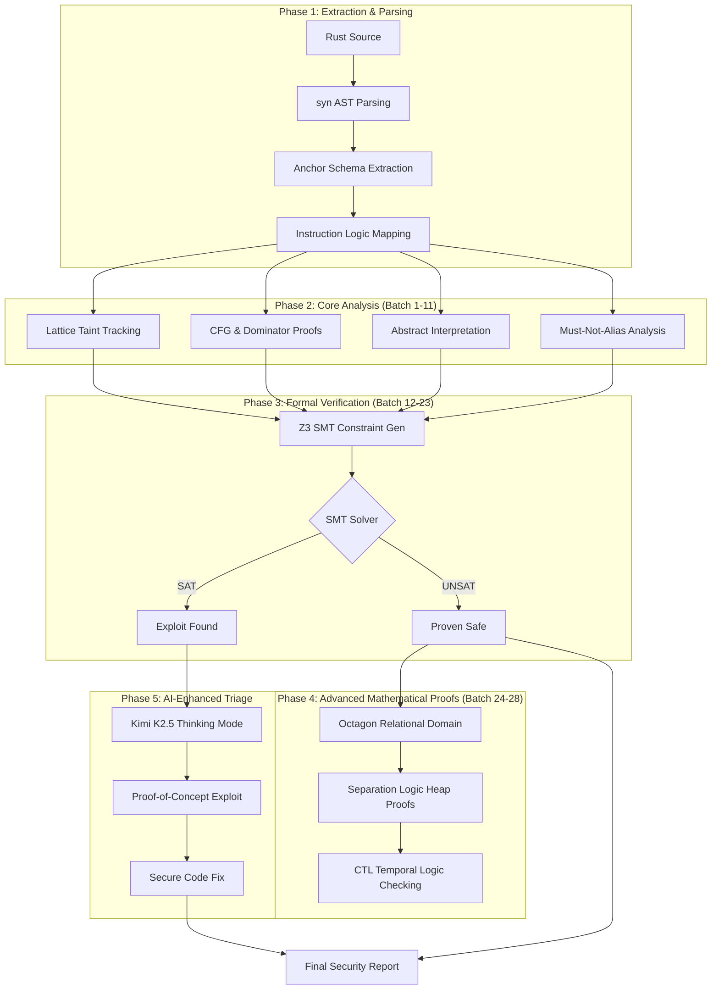

# Proktor — Proof of Security 🛡️

[](https://opensource.org/licenses/MIT)
[](https://solana.com/)
[](https://www.rust-lang.org/)
[](https://github.com/Z3Prover/z3)

**Know your Solana program is secure before mainnet.**

Proktor is the world's most advanced formal verification and security suite for Solana smart contracts. It combines **28 phases of mathematical proof**, **AI-driven "Thinking Mode" research**, and **lattice-based taint analysis** to provide absolute confidence in your program's safety.

---

## 🏛️ Architecture: The 28-Phase Pipeline

Proktor doesn't just "scan" code; it builds a multi-layered mathematical model of your program and attempts to prove safety properties across 4 specialized batches.


```mermaid
graph TD
    subgraph "Phase 1: Extraction & Parsing"
        A[Rust Source] --> B[syn AST Parsing]
        B --> C[Anchor Schema Extraction]
        C --> D[Instruction Logic Mapping]
    end

    subgraph "Phase 2: Core Analysis (Batch 1-11)"
        D --> E[Lattice Taint Tracking]
        D --> F[CFG & Dominator Proofs]
        D --> G[Abstract Interpretation]
        D --> H[Must-Not-Alias Analysis]
    end

    subgraph "Phase 3: Formal Verification (Batch 12-23)"
        E & F & G & H --> I[Z3 SMT Constraint Gen]
        I --> J{SMT Solver}
        J -- SAT --> K[Exploit Found]
        J -- UNSAT --> L[Proven Safe]
    end

    subgraph "Phase 4: Advanced Mathematical Proofs (Batch 24-28)"
        L --> M[Octagon Relational Domain]
        M --> N[Separation Logic Heap Proofs]
        N --> O[CTL Temporal Logic Checking]
    end

    subgraph "Phase 5: AI-Enhanced Triage"
        K --> P[Kimi K2.5 Thinking Mode]
        P --> Q[Proof-of-Concept Exploit]
        Q --> R[Secure Code Fix]
    end

    R --> S[Final Security Report]
    L --> S
```

---

## 🚀 Key Analysis Engines

### 1. Z3-Backed Formal Verification
Proktor converts Rust arithmetic and access control predicates into **Z3 Bitvector (BV64) constraints**.
- **Automated Overflow Proofs**: Prove `a + b` cannot overflow for any `u64` input.
- **Division-by-Zero Freedom**: Mathematically guarantee divisors are never zero.
- **Counterexample Generation**: If a bug exists, Z3 finds the *exact* inputs needed to trigger it.

### 2. Lattice-Based Taint Analysis
Implements a formal information-flow system over a 6-level security lattice:
- **Lattice**: `Untainted (⊥) ⊑ AccountInput ⊑ ExternalData ⊑ Tainted (⊤)`
- Detects untrusted user data reaching privileged "sinks" like `invoke_signed` or `transfer`.
- Uses a **chaotic iteration worklist algorithm** to find the least fixed point of data contamination.

### 3. Abstract Interpretation (Interval & Octagon)
- **Interval Domain**: Tracks `[min, max]` ranges for every variable, including loop widening/narrowing.
- **Octagon Domain**: Captures relational constraints like `amount ≤ balance` using **Difference Bound Matrices (DBMs)**.

### 4. CFG & Dominator Proofs
- Builds a full **Control Flow Graph** from the AST.
- Computes **Dominator Trees** to prove that an authorization check *must* execute before any token transfer.
- Validates **Checks-Effects-Interactions** via state-mutation dominance over CPI calls.

---

## 🛡️ Proktor Guard: Dependency Firewall

Proktor includes a specialized supply chain security engine that protects against malicious dependencies.

| Layer | Technique | Protection |
| :--- | :--- | :--- |
| **Advisory** | Hash-matching | Blocks known backdoors (e.g., `@solana/web3.js` 1.95.6) |
| **Typosquat** | Levenshtein Distance | Detects `solana-sdk` vs `solana-skd` |
| **Behavioral** | Static Analysis | Flags runtime key exfiltration or clipboard hijacking |
| **Source** | Origin Verification | Blocks untrusted git/path dependency origins |

---

## 🤖 AI "Thinking Mode" Research
Powered by **Kimi K2.5**, Proktor provides expert-level technical analysis for every finding.
- **Reasoning Traces**: See the "chain-of-thought" as the AI researches the exploit vector.
- **PoC Generation**: Automatically generates executable Rust/TypeScript exploit scripts.
- **Remediation**: Provides high-quality, idiomatic secure code fixes.

---

## 📊 Vulnerability Knowledge Base (Top 100)
Proktor is mapped against a proprietary database of the **Top 100 Solana Vulnerabilities**, including:
- **Authentication**: Missing Signer (SOL-001), Missing Owner (SOL-003).
- **DeFi Logic**: Price manipulation, Flash loan vectors, Slippage bypass.
- **Solana Specifics**: PDA Seed collisions, Account aliasing, Reinitialization.
- **Formal Errors**: Integer overflow (proven), Division by zero (proven).

---

## 🛠️ Installation

### One-Line Installer
```bash
curl -sSfL https://proktor.security/install.sh | sh
```

### Build from Source
```bash
git clone https://github.com/brainless3178/proktor.git
cd proktor
cargo build --release -p proktor-cli
```

---

## 📖 Usage

### Interactive Scan
Launch the modern TUI dashboard to analyze your program:
```bash
proktor scan ./programs/my-program
```

### CI/CD Integration
Proktor is designed for CI. Use `.proktor.toml` to configure thresholds:
```toml
[scan]
min_severity = "high"
fail_on = "critical"
format = "sarif"

[engines]
z3_verification = true
taint_analysis = true
```

---

## 📄 License
Copyright (c) 2026 Proktor Security.
Distributed under the **MIT License**. See [LICENSE](LICENSE) for details.

---
*Powered by [Proktor Security Oracle](https://proktor.security) • 52+ detectors • Z3 formal proofs*
